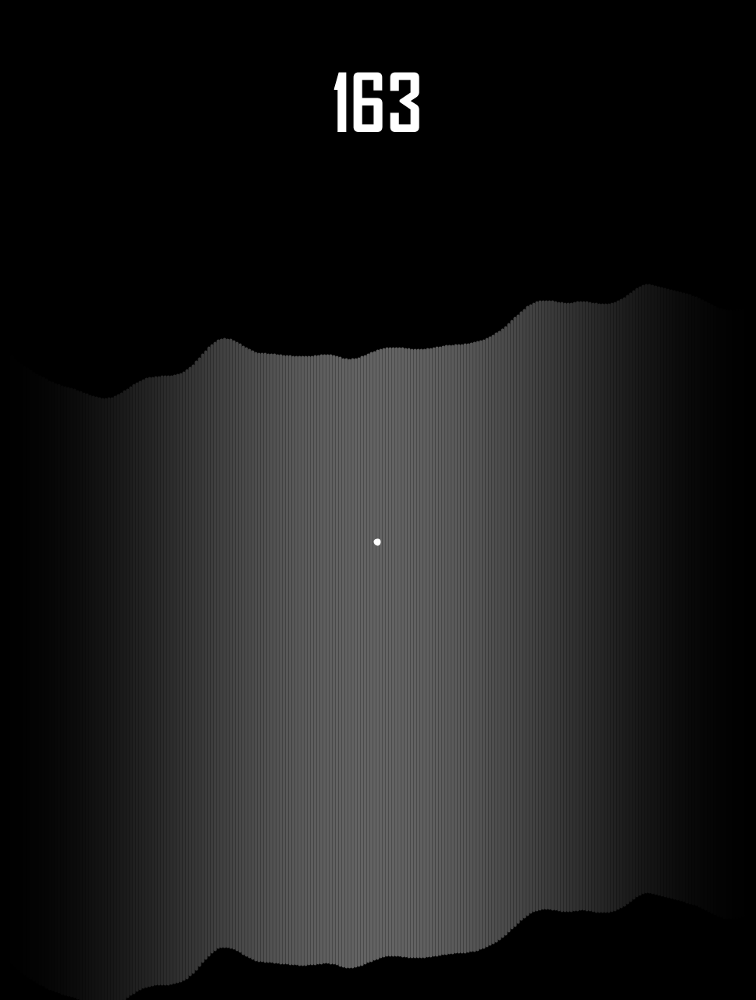

# Infinite-cave-game
This is a simple game made with Processing 3.0.
It's available on the google play store as [Cavern Dash](https://play.google.com/store/apps/details?id=com.LukasKuppers.CavernDash).

### basic controls
- hold the screen, (or use left mouse button on PC) in order to make the player fly
- survive as long as you can in the ever shrinking cave

### technical details
- cave generated by layering different octaves of perlin noise
- all visuals created using Processing 3.0 primatives
- player controled using touch (or mouse) input
